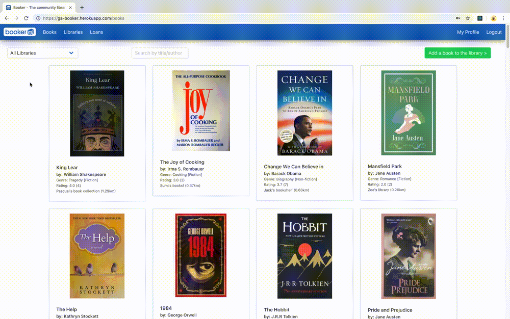
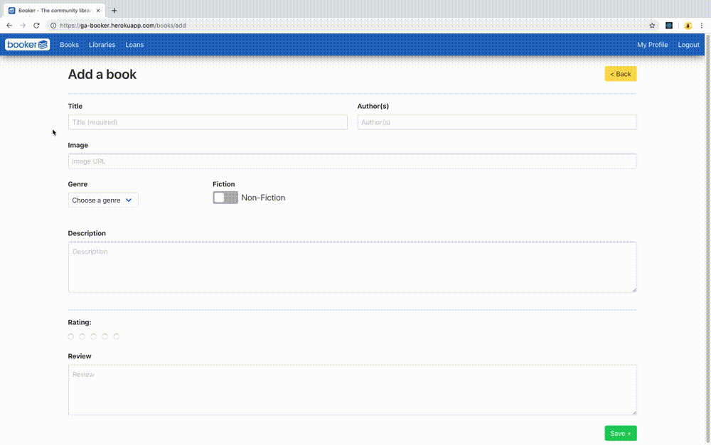
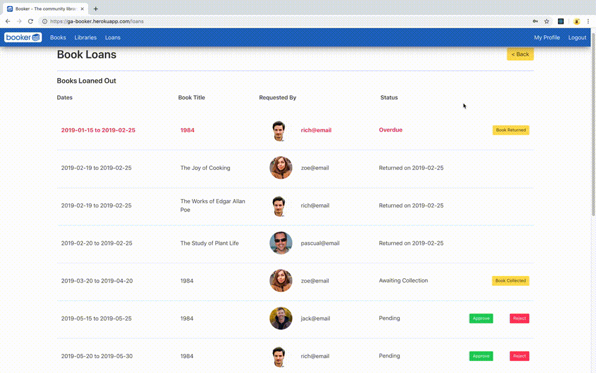

# **Booker** : The Community Library Project

## Project 3 : Web Development Immersive, General Assembly 

### Deployed version

https://ga-booker.herokuapp.com/

## Table of Contents

1. [Brief](#brief)
2. [Team](#team)
3. [Overview](#overview)
4. [Technologies](#technologies)
5. [Team Organisation](#team-organisation)
6. [Development process](#development)
[Project Deliverables](#project-deliverables---front-end)
[Testing](#testing)
[Wins](#wins)
8. [Challenges](#challenges)
[Future Features](#future-features)

## Brief
With a time frame of 7 days, create a full-stack application using an Express API to serve data from a Mongo database. The front-end should be built with React, with multiple relationships and CRUD functionality for at least a couple of models. The app should have automated testing on at least one RESTful resource on the backend.

## Team
In alphabetical order:

| Name | GitHub |
|-------|--------------------------------|
| Orjon | https://github.com/orjon |
| Ru | https://github.com/RuLette |
| Sumi | https://github.com/SumiSastri |
| Wesley | https://github.com/wesley-hall |

## Overview:

Booker is a web app book sharing community - where users share their book collections by loaning out and borrowing books from other user.

 #### Books

 | Viewing all books, filtering by library, searching for a specific book and then rating and reviewing it. |
 |:--:|
 |  |

 | Adding a new book from the main Books page |
 |:--:|
 |  |

 #### Book Loans - Borrowed

 | Borrowing a book and managing loan requests for books that the logged in user has borrow |
 |:--:|
 |  |

 #### Book Loans - Loaned Out

 | Managing loan requests for loans from the logged in user |
 |:--:|
 |  |

Functionality:
- The user can register, login and update or delete their user profile
- The user upload their books to the app and create a library of books so that other users can borrow them
- The user can view other peoples’ books and request to borrow books from their libraries
- The user can accept or reject a request to borrow the books in their library
- The user can know how far the books they want to borrow are and where other libraries are on a map
- They can see the book title, author, reviews and ratings of books to make decisions whether to borrow the book or not
- The user can view books out on loan and the books they are loaning in one place

 | Page | Path | Features <br> _(Logged Out)_ | Additional Features <br> _(Logged In)_ |
 |:---:|:---:|---|---|
 | [Nav bar](./src/components/common/nav.js) | _On all pages_ | - Navigate to pages that do not require login <br> - Login or register | - Navigate to SecureRoute pages <br> - Logout |
 | [Home](./src/components/pages/home.js) | / | View the app name/logo and tagline | |
 | [About](./src/components/pages/about.js) | /about | View the value proposition/brief explanation |  |
 | [Login](./src/components/auth/login.js) | /login | Login as a returning (registered) users | |
 | [Register](./src/components/auth/register.js) | /register | Register as a new user | |
 | [Books (All)](./src/components/books/booksAll.js) | /books | View all books in the database | View the distance between the logged in user's library and the libraries that the books are in  |
 | [Book Show (Individual books)](./src/components/books/bookShow.js) | /books/:id |  View details of the chosen book: <br> - Book title <br> - Author <br> - Rating and reviews <br> - Owner information <br> - Loan request functionality |  - All users can rate and review the book <br> - Existing reviews can be deleted by the user that created the review <br> - Users that own the book can remove/delete it |
 | [Book Add](./src/components/books/bookAdd.js) | /books/add | _Login required to access this page_ | Add a book by filling in a blank [BookForm](./src/components/books/bookForm.js) with the following: <br> - Text fields for title, author, image URL <br> - Select dropdown with options for genre <br> - Checkbox (styled as a toggle button) for non-/fiction <br> - Radio buttons for review <br> - Textarea for description and review |
 | [Book Update](./src/components/books/bookUpdate.js) | /books/:id/update | _Login required to access this page_ | Users that own the book can change book information by filling in a pre-populated version of the [BookForm](./src/components/books/bookForm.js) |
 | [Book Loan](./src/components/books/bookLoan.js) | /books/:id/loan | _Login required to access this page_ | Users that don't own the book can create loan requests |
 | [Libraries](./src/components/books/libraries.js) | /libraries | View all libraries by location, including: <br> - A book count in the marker <br> - Library name, picture and description in a popup |  - View the logged in user's own library location and details <br> - Link to the User Profile page to view and edit user information |
 | [Loans](./src/components/loans/loansAll.js) | /loans | _Login required to access this page_ | Loan management page for books loaned out and books borrowed |
 | [User Profile](./src/components/users/userprofile.js) | /users | _Login required to access this page_ | Profile page of the user where they can view and delete their profile and library information |
 | [Edit Profile](./src/components/users/userEdit.js) | /userEdit | _Login required to access this page_ | Page for users to update their profile and library information |
 | [404](./src/components/pages/404.js) | /* | Error 404 page for when users attempt to access a page that does not exist | &nbsp; |

## Technologies

| Front End | Back End | Testing | Other |
|:---:|:---:|:---:|:---:|
| React | Node.js | Mocha | yarn |
| ReactDOM | MongoDB (NoSQL) | Chai | Webpack |
| React Router DOM | Express | SuperTest | Babel |
| Bulma | Mongoose | | Axios |
| SCSS | mongoose-autopopulate  | | |
| Mapbox GL JS | JSON Web Tokens (JWT) | | |
| | bcrypt | | |
| | dotenv | | &nbsp; |

The full list of dependencies and dev dependencies in the [`package.json`](./package.json)

## Team Organisation

- Team is self-organising
- Decisions are made democratically
- Trouble shoot early and often
- Support quickly and solve problem
- Seek to solve the problem with root cause analysis
- The whole team is responsible for positive outcomes and good quality code
- Interactions better than documentation

Our team met every morning so we could communicate our progress and we could discuss what to prioritise for the day. During the project we sat near one another and we were able to communicate our workflow. This also allowed rapid decision making when any of the team encountered an issue with their individual task at hand.

## Development process

The development process began with our team agreeing on the functionality we wanted in our application. Early in the development stage we broke down all the application's functions into groups that would become the 'pages' of the application.

We first began creating wireframes to work out this structure and general content placement of the website. These were sketched out on pieces of paper and the arrangement of these helped us to map out a clear user journey, and separate concerns.


This was an iterative, sometimes subjective, but ultimately very constructive process. Sketching out the user flows in this way greatly assisted in structuring the code and filing.

When we had decided our workflow we decided all team members should experience working on the backend and front end of the application.

# Work allocation

In the back end I first created a schema for books.

```js
const bookSchema = new mongoose.Schema({
 title: {type: String, required: true},
 authors: {type: String},
 image: {type: String},
 fiction: {type: Boolean, required: true},
 genre: { type: mongoose.Schema.ObjectId, ref: 'BookGenre'},
 description: {type: String},
 rating: [ratingSchema],
 review: [reviewSchema],
 owner: { type: mongoose.Schema.ObjectId, ref: 'User', autopopulate: true }
})
```
Book information with references to the BookGenre and User schemas, as well as information for book ratings and reviews.

```js
const ratingSchema = new mongoose.Schema({
 rating: {type: Number, min: 1, max: 5},
 user: {type: mongoose.Schema.ObjectId, ref: 'User',  autopopulate: true }
})
```
```js
const reviewSchema = new mongoose.Schema({
 review: {type: String},
 user: {type: mongoose.Schema.ObjectId, ref: 'User', autopopulate: true }
})
```
#### [Seeds](./db/seeds.js)

Next I created a few seeds for books.

#### Seeds promises
In the seeds file, JavaScript promises were used to ensure that the database is always seeded in the correct order. This is because certain data models require others to exist before they can be created:
  - Books can only be created once users (book owners) and genres have been created
  - Loans can only be created once users and books have been created
```js

const promiseArray = [
  User.create([...]),
  BookGenre.create([...])
]

Promise.all(promiseArray)
  .then(data => {
    const [ users, genres ] = data
    return Promise.all([
      Books.create([...]),
      users
      ])
    })
  .then(data => {
    const [ books, users ] = data
    return Loan.create([...])
  })
```

## Testing
I used the seeds to test the book schema I created, along with the CRUD routes to ensure it was working.

I then created a test resource for the books using chai and mocha. Supertest was a library installed to make HTTP calls within the test environment. This meant that in the test file, a local test environment could be created with 'dummy data'.

The dummy book data used for the test was named in a const called bookData. As defined in our book schema, fields such as the title and fiction are required and a test would not pass unless these two fields were filled.

~~~
const bookData = {
  title: 'The Hobbit',
  authors: 'J.R.R Tolkien',
  image: 'http://www.orjon.com/dev/booker/images/bookcovers/cover-theHobbit.jpeg',
  fiction: true,
  description: ' In a hole in the ground there lived a hobbit. Not a nasty, dirty, wet hole, filled with the ends of worms and an oozy smell, nor yet a dry, bare, sandy hole with nothing in it to sit down on or to eat: it was a hobbit-hole, and that means comfort.'
}
~~~

As some routes such as posting a book required user authentification, the user environment and JWT token had to be imported into the test environment.

~~~
beforeEach(done => {
  Book.collection.remove()
  Book.create(
    bookData
  )
    .then(() => User.remove({}))
    .then(() => User.create({
      username: 'test',
      email: 'test',
      password: 'test',
      passwordConfirmation: 'test',
      location: {
        lat: 51.4,
        lng: 21
      },
      libraryName: 'test'

    }))
    .then(user => {
      token = jwt.sign({ sub: user._id }, secret, { expiresIn: '6h' })
      done()
    })

    .catch(done)
})
~~~

~~~
describe('POST /api/books', () => {
  it('should return a 201 response', done => {
    api
      .post('/api/books')
      .set({ 'Accept': 'application/json', 'Authorization': `Bearer ${token}`})
      .send(bookData)
      .end((err, res) => {
        console.log(err)
        expect(res.status).to.eq(201)
        done()
      })
  })
~~~

#User Profile

When I had completed testing for the book add and creation routes, more functionality was added to the application by allowing the logged in user to update their details, or delete their profile.

[Users](./controllers/users.js)

Complete CRUD cycle for users:

| CRUD | API Route | HTTP Method |
|---|---|---|
| Create | /api/register | POST |
| Read | /api/users <br> /api/users/:id | GET |
| Update | /api/users/:id | PUT |
| Delete | /api/users/:id | DELETE |

  ```js

function userShow(req, res) {
  User
    .findById(req.params.id)
    .then(user => res.status(200).json(user))
    .catch(err => res.json(err))
}
  ```
If the user deletes their account, the books and loans in relation to their account has to be deleted as well.

~~~
handleDelete(e) {
  e.preventDefault()
  if (window.confirm('Delete the item?')) {
    axios.delete(`/api/users/${Auth.getPayload().sub}`,
      { headers: { Authorization: `Bearer ${Auth.getToken()}`}})
      .then(() => {
        Auth.logout()
        this.props.history.push('/')
      })
      .catch(err => this.setState({errors: err.response.data.errors}))
  }
}
~~~
Hence the userDelete function in the backend required a promise to be written so that the books belonging to the user could be deleted as well.
~~~
function userDelete(req, res) {
  const promiseArray = [
    Book
      .remove({owner: req.params.id}),
    User
      .findByIdAndRemove(req.params.id)
      .exec()
  ]

  Promise.all(promiseArray)
    .then(() => res.sendStatus(204))
    .catch(err => res.status(500).json(err))
}
~~~

### Styling

#### Concept
Our group decided to keep the interface simple and intuitive to use. Hence styling was implemented using the [Bulma CSS framework](https://bulma.io/). Bulma has classes which are structured greatly speed up the process of creating grid layouts in particular, such as we used for the Books (All) page.

There are several different sets of information that need to be displayed on the various pages of the site - the aim was to keep these as uniformed as possible. To help visually tie the pages together a colour-coded styling language was developed for the buttons.

| |Buttons|
|:----:|:----|
|Large||
|Small||

View the style SCSS file [here](./src/style.scss)

## Challenges

 - Creating the promise functions in the seeds file - figuring out the order of promises needed
 - Creating the test files - had to create a proxy user to test functionality
 - Nav bar bugs - challenges logging out users
 - Figuring out search and filter functions in React - pulling data into the render function
 - User profile - giving users the ability to set their own location using a map marker
 - Loans - scoping features and functions to fit time lines
 - Project management of roles and division of work - sprint rules difficult to follow for a one week project

## Wins

 - Key technologies used by everyone
 - User journeys well mapped out and data-flows discussed in detail
 - Good road-maps to map out back-log
 - Testing started early

## Future Features

- In future we could add user to user messaging within the app
- Users could be allowed to borrow other library items, like record collections and other multimedia in future
